# Edge One - Game Level For Tremulous
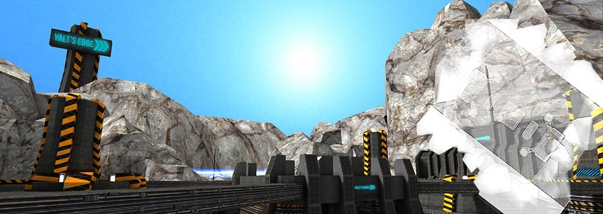

## Overview: The first Edge Map
Edge One is a game level by Matthias "Masmblr" Peters for the open source game Tremulous.

Map Description: 
> Edge One is the first map i created for the mod "Edge". It is a symmetrical map. Some parts of the front-entrance was borrowed from the map "ATCS-HD". Featuring two opposing bases situated at opposite ends, the map's focal point is a spacious central area. This open expanse is surrounded by large rocks, maintaining a natural ambiance. The skybox above has been meticulously crafted to enhance the overall atmosphere. Additionally, "Edge One" incorporates a handful of new texture. 

* * *
 
## Screenshots:
[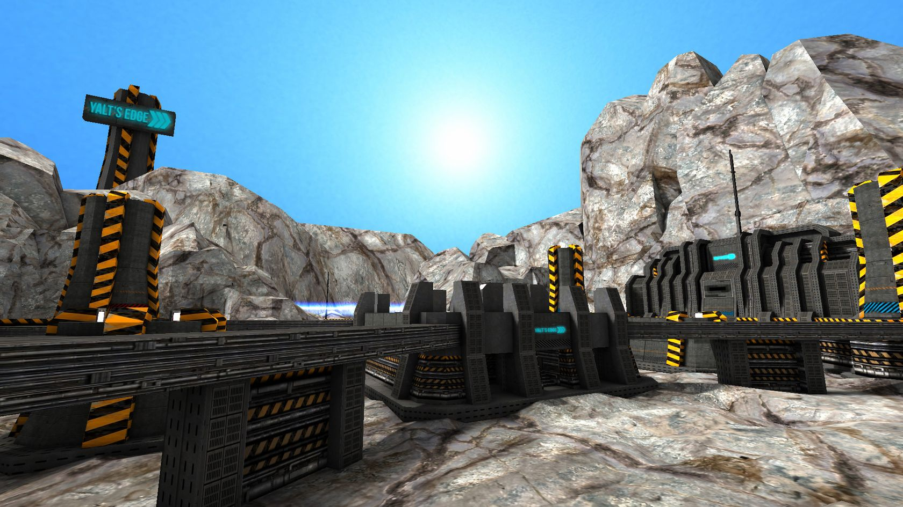](meta/preview_levelshots/1.jpg)
[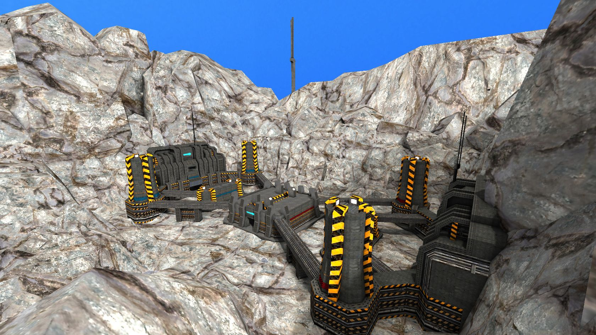](meta/preview_levelshots/2.jpg)
[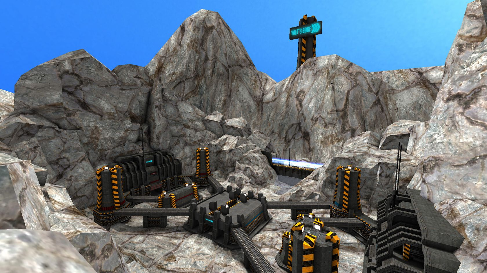](meta/preview_levelshots/3.jpg)
[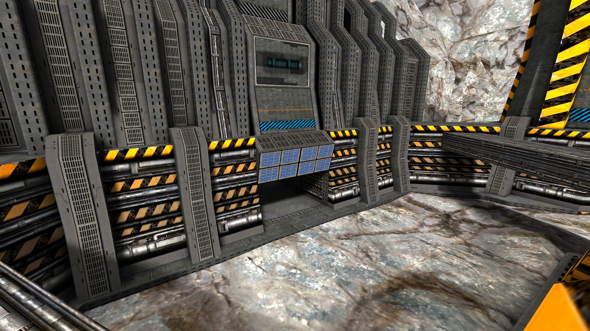](meta/preview_levelshots/4.jpg)
[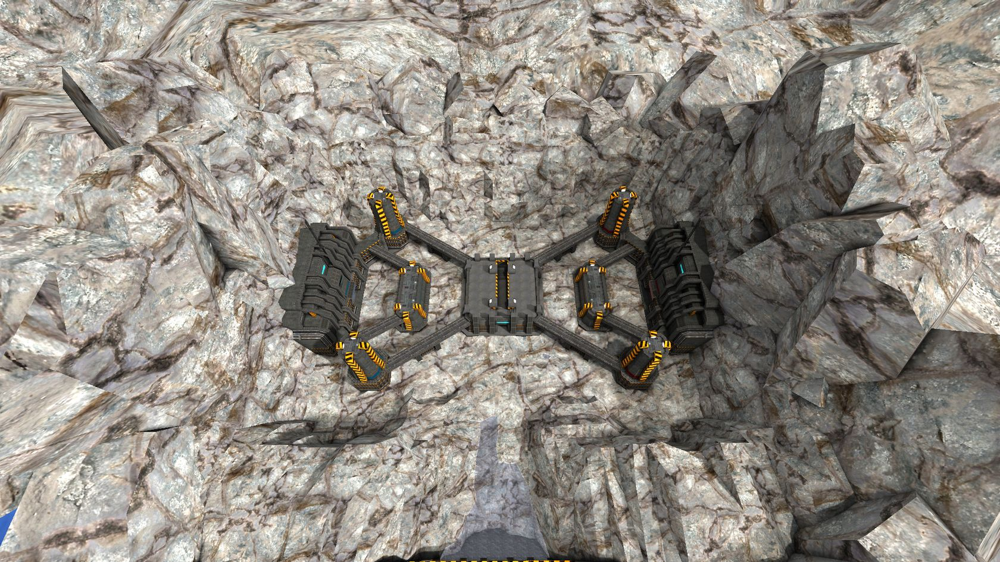](meta/preview_levelshots/5.jpg)
[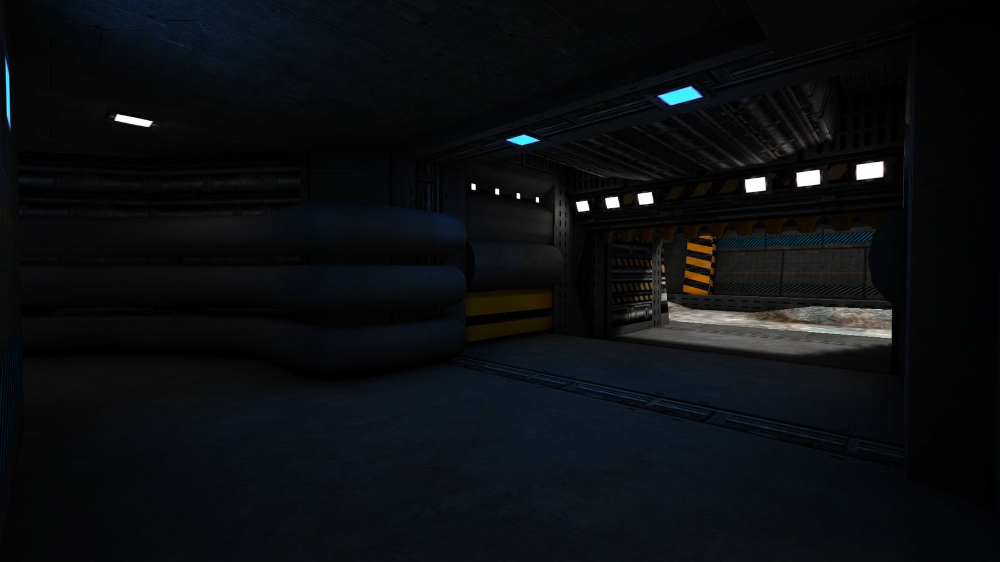](meta/preview_levelshots/6.jpg)
[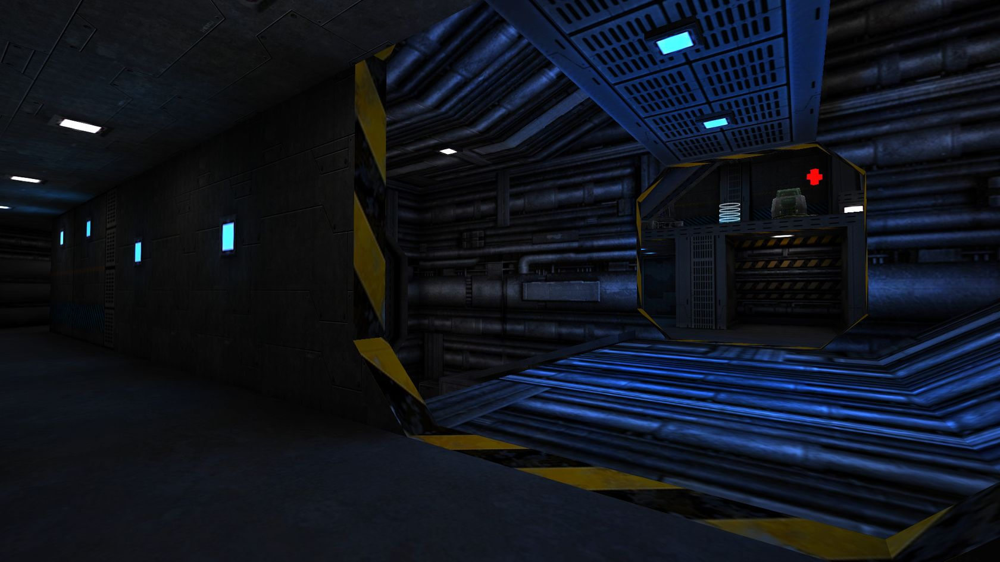](meta/preview_levelshots/7.jpg)
[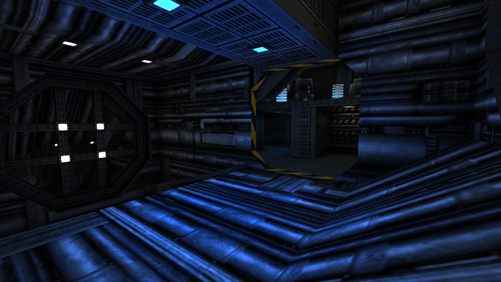](meta/preview_levelshots/8.jpg)
[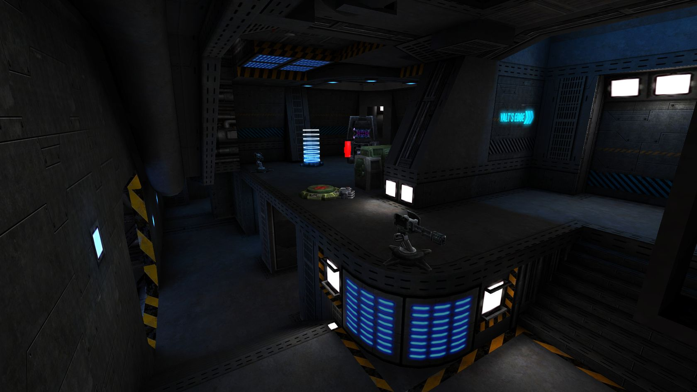](meta/preview_levelshots/9.jpg)

## Textures
Some textures I have drawn for the map: </br>
[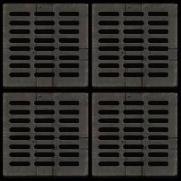](meta/preview_textures/1.jpg)
[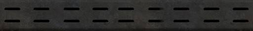](meta/preview_textures/2.jpg)
[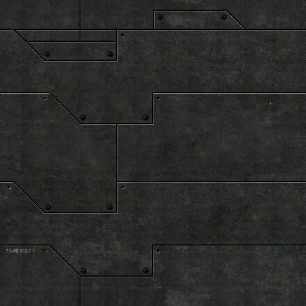](meta/preview_textures/3.jpg)
[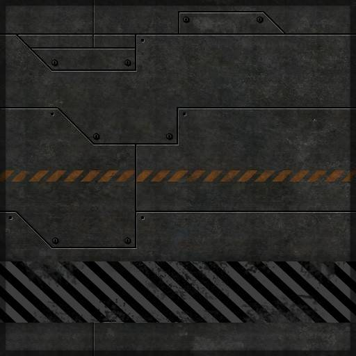](meta/preview_textures/4.jpg)
[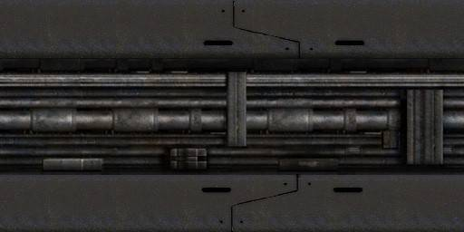](meta/preview_textures/5.jpg)
[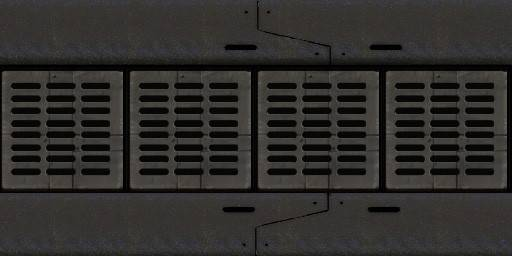](meta/preview_textures/6.jpg)
[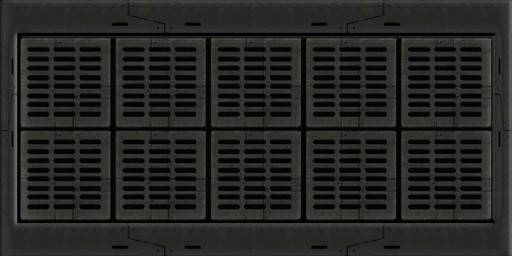](meta/preview_textures/7.jpg)
[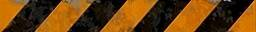](meta/preview_textures/8.jpg)

## Version History:
| Version: | Date:        | Status: | Release Build (.pk3):       
| ------- | ------------- | ------: | -----------------: |
| 0.1 - 0.3     | 13/06/2014  | alpha | :x:        |     
| 1.0     | 26/08/2023  | final | [💾](https://github.com/Masmblr/map-Edge_One_src/releases/) |

## How-To
**Binary**:
1. Download the release package.
2. Save the *.pk3 file to the following directory: `/%PATH%/Tremulous/base/`.
3. Start the Tremulous game and select "Create Server" with the desired map.

**Source**:
1. Download the [source release](https://github.com/Masmblr/map-Edge_One_src/releases/) and the [tremulous-common-files](https://github.com/Masmblr/tremulous-map-common/releases/tag/v1.0).
2. Extract the files to the default installation directory. It should look like this:

```
DRIVE:/%PATH%/tremulous/
|   tremulous.exe
|   tremulous.x86
|   ...
+---base
|   |   autogen.cfg
|   |   data-1.1.0.pk3
|   |   map-atcs-1.1.0.pk3
|   |   ...
|   +---env
|   +---maps 
|   +---models 
|   +---scripts
|   +---sounds
|   \---textures
```
1. Download [NetRadiant Level Editor](https://netradiant.gitlab.io/page/download/).
2. Launch NetRadiant and select "Tremulous" as your game setting.
3. Open the '.map' file located in the directory `/%PATH%/tremulous/base/maps` and, from the menu, choose 'Build -> 'Build with final settings.'
4. Start the Tremulous game with `-sv_pure 0 -devmap MAPNAME`. Make sure to replace "MAPNAME" with the actual name of the map you compiled.

## Development Tools:
Photoshop CS6 \
[Audacity](https://www.audacityteam.org/) \
[NetRadiant](https://netradiant.gitlab.io/) \
[Q3Map2](http://q3map2.robotrenegade.com/)

## Related Resources:
Official Tremulous website: https://tremulous.net </br>
NET Radiant Level-Editor: https://netradiant.gitlab.io </br>
Master-Server-List: http://dpmaster.deathmask.net/?game=tremulous </br>
Unofficial successor "Unvanquished": https://unvanquished.net

## Legal Information and Attribution
Some assets may be derivative works or subject to different licenses. Please refer for author and license details. Note that some files may have been modified. Below is a list of files and their legal statuses.

***
env\edge_one\skybox_bk.jpg <sup>[1](#Credit- </sup> \
env\edge_one\skybox_dn.jpg <sup>[1](#Credit-</sup> \
env\edge_one\skybox_ft.jpg <sup>[1](#Credit-</sup> \
env\edge_one\skybox_lf.jpg <sup>[1](#Credit-</sup> \
env\edge_one\skybox_rt.jpg <sup>[1](#Credit-</sup> \
env\edge_one\skybox_up.jpg <sup>[1](#Credit-</sup> \
levelshots\edge_one.jpg <sup>[1](#Credit-</sup> \
maps\edge_one.map <sup>[1](#Credit-</sup> \
models\edge_one\terrain.md3 <sup>[1](#Credit-</sup> \
scripts\edge_one.arena <sup>[1](#Credit-</sup> \
scripts\edge_one.shader <sup>[1](#Credit-</sup> \
scripts\shaderlist.txt <sup>[1](#Credit-</sup> \
textures\edge_one\black.jpg <sup>[1](#Credit-</sup> \
textures\edge_one\floor_checkerplates.jpg <sup>[1](#Credit-</sup> \
textures\edge_one\light_plates_blue.jpg <sup>[1](#Credit-</sup> \
textures\edge_one\light_plates_red.jpg <sup>[1](#Credit-</sup> \
textures\edge_one\light_small_01.jpg <sup>[1](#Credit-</sup> \
textures\edge_one\light_small_01_add.jpg <sup>[1](#Credit-</sup> \
textures\edge_one\light_small_01_add_blue.jpg <sup>[1](#Credit-</sup> \
textures\edge_one\light_small_01_add_red.jpg <sup>[1](#Credit-</sup> \
textures\edge_one\nature_rocks.jpg <sup>[3](#Credit-3)</sup> \
textures\edge_one\nature_water.jpg <sup>[1](#Credit-</sup> \
textures\edge_one\sfx_forcefield.jpg <sup>[1](#Credit-</sup> \
textures\edge_one\sfx_forcefield_base.jpg <sup>[1](#Credit-</sup> \
textures\edge_one\sign_bases.jpg <sup>[1](#Credit-</sup> \
textures\edge_one\sign_edge.jpg <sup>[1](#Credit-</sup> \
textures\edge_one\sign_edge_add.jpg <sup>[1](#Credit-</sup> \
textures\edge_one\tech_02.jpg <sup>[1](#Credit-</sup> \
textures\edge_one\tech_03.jpg <sup>[1](#Credit-</sup> \
textures\edge_one\tech_04.jpg <sup>[1](#Credit-</sup> \
textures\edge_one\tech_05.jpg <sup>[1](#Credit-</sup> \
textures\edge_one\tech_06.jpg <sup>[4](#Credit-4)</sup> \
textures\edge_one\tech_07.jpg <sup>[1](#Credit-</sup> \
textures\edge_one\tech_box_01.jpg <sup>[1](#Credit-</sup> \
textures\edge_one\tech_box_02.jpg <sup>[1](#Credit-</sup> \
textures\edge_one\tech_caution.jpg <sup>[1](#Credit-</sup> \
textures\edge_one\tech_pipe_01.jpg <sup>[1](#Credit-</sup> \
textures\edge_one\tech_pipes.jpg <sup>[1](#Credit-</sup> \
textures\edge_one\tech_plates.jpg <sup>[1](#Credit-</sup> \
textures\edge_one\tech_shield.jpg <sup>[1](#Credit-</sup> \
textures\edge_one\tech_vent.jpg <sup>[1](#Credit-</sup> \
textures\edge_one\trim_01.jpg <sup>[1](#Credit-</sup> \
textures\edge_one\wall_01.jpg <sup>[1](#Credit-</sup> \
textures\edge_one\wall_01_blue.jpg <sup>[1](#Credit-</sup> \
textures\edge_one\wall_01_mid.jpg <sup>[1](#Credit-</sup> \
textures\edge_one\wall_01_neutral.jpg <sup>[1](#Credit-</sup> \
textures\edge_one\wall_01_red.jpg <sup>[1](#Credit-</sup> \
textures\edge_one\wall_01_step_01.jpg <sup>[1](#Credit-</sup> \
textures\edge_one\wall_01_step_02.jpg <sup>[1](#Credit-</sup> \
textures\edge_one\wall_01_step_03.jpg <sup>[1](#Credit-</sup> \
textures\edge_one\wall_01_thin.jpg <sup>[1](#Credit-</sup> \
textures\edge_one\wall_01_thin_02.jpg <sup>[1](#Credit-</sup> \
textures\edge_one\wall_01_thin_03.jpg <sup>[1](#Credit-1) </sup>
***

### Credit-1
[Matthias "Masmblr Peters"](mailto:masmblr@gmail.com) \
Content: Map, Textures, Shaders \
License: [MIT License](https://opensource.org/license/mit/).
(See "LICENSE" file for more Informations.)

### Credit-2
Superpie, Ingar \
Content: ATCS HD Brushwork (Front-Entrance) \
License: Attribution License

### Credit-3
Philip “Blazeeer” Klevestav \
Content: pk-Textures \
License: Attribution License

### Credit-4
Milosh Andrich \
Content: Sci fi 05 \
License: Attribution License

For all other content, their respective licensing rules and other legal provisions apply.

## Special Thanks:
* id Software for Quake3
* Dark Legion Development for Tremulous
* Team Xonotic for NetRadiant 
